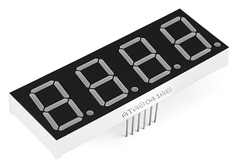

# NumDisplay

Raspberry Pi package for controlling the 7-segment numeric displays written in Julia.

## Approaches

- Direct method does not use any chips transforming input but it requires more GPIO pins. See [DisplayDirect](https://metelkin.github.io/NumDisplay.jl/dev/direct/).
- BCD is a Binary-Coded Decimal chip which can be used to manage display with several digits. See [DisplayBCD](https://metelkin.github.io/NumDisplay.jl/dev/bcd/).
- SPI uses MAX7219/MAX7221 chip which is popular to control up to 8 digits 7-segment displays. See [DisplaySPI](https://metelkin.github.io/NumDisplay.jl/dev/spi/).

## More info

[Read the docs](https://metelkin.github.io/NumDisplay.jl/dev).

## License

Published under [MIT License](LICENSE)

## Useful links

- Docs of PIGPIO lib used http://abyz.me.uk/rpi/pigpio/cif.html
- SPI explanations https://www.analog.com/en/analog-dialogue/articles/introduction-to-spi-interface.html#