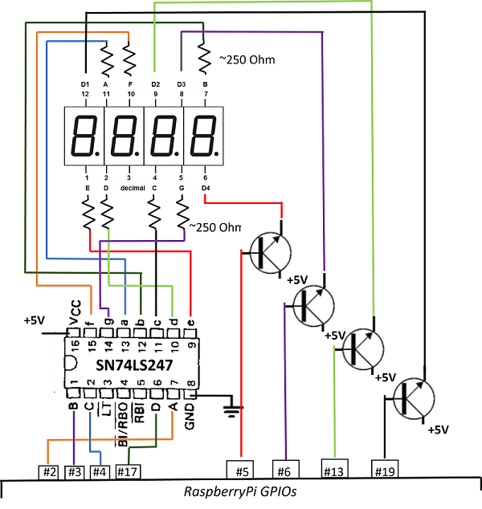

# BCD approach

BCD is a Binary-Coded Decimal chip which can be used to manage display with several digits.

The chip transforms the binary code (4 bits: A, B, C, D) to the 7-segment (a,b,c,d,e,f,g) LED states representing decimal number. If you use the indicator with common anode you need to switch the digits by additional signal: one pin for one digit. 

The method requires 4 pins to display decimal and additionally one pin per digit.
If you use dot on display you need the additional pin.
For example 4-digits-display requires 4 + 1 + 4 = 9 GPIO pins. 
8-digits-display requires 4 + 1 + 8 = 13 GPIO pins.

**Common anode chips examples**

- **246** : SN54246, SN74246
- **247** : SN54247, SN74247
- **LS247** : SN54LS247, SN74LS247(*)
- **LS248** : SN54LS248, SN74LS248

(*) was tested

## Usage

**Without dot**

```julia
using NumDisplay
d = DisplayBCD(
    [       # pins to on/off digits
        5,  # less significant decimal digit
        6,
        13,
        19   # most significant decimal digit
    ],
    (      # pins connected to chip to transform bits to decimal number
        2, # A (less significant bit)
        3, # B
        4, # C
        17 # D (most significant bit)
        -1 # no pin for dot
    )
)

write_number(d, 666) # write _666
shutdown_mode_off(d) # display _666

sleep(1)
shutdown_mode_on(d)              # display nothing
```

**With dot**

```julia
using NumDisplay
d = DisplayBCD(
    [       # pins to on/off digits
        5, # less significant decimal digit
        6,
        13,
        19   # most significant decimal digit
    ],
    (      # pins connected to chip to transform bits to decimal number
        2, # A (less significant bit)
        3, # B
        4, # C
        17, # D (most significant bit)
        27 # pin to control dot
    )    
)

shutdown_mode_off(d)
write_number(d, 666) # display _666
sleep(1)
write_number(d, 666, 2) # display _66.6
sleep(1)
shutdown_mode_on(d)     # display nothing
```

## Circuit

**Without dot**




[](https://youtu.be/gWjStU8-2Ug)

**Notes**

- Here I was using the NPN transistors to switch digits because I had them but MOSFETs was also possible there.
- To use the dot symbol (which is also available on the indicator) it is required to add one additional pin.
