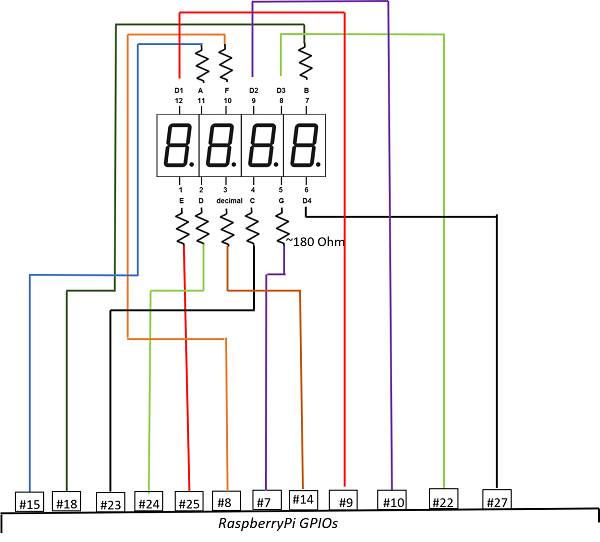

# Direct approach

This method does not require any chip. Each segment in sector is managed by its own GPIO pin.
It can serve the common-anode and common-cathod display.

The method requires 7 pins to display decimal and additionally one pin per sector.
For example 4-sector-display requires 7 + 4 = 11 GPIO pins. 
8-sector-display requires 7 + 8 = 15 GPIO pins.

If you use dot on display you need the additional pin.
For example 4-sector-display requires 7 + 1 + 4 = 12 GPIO pins. 

## Usage

**Without dot**

```julia
using NumericDisplay
d = DisplayDirect(
    [       # pins to on/off sectors
        5, # less significant decimal digit
        6,
        13,
        19   # most significant decimal digit
    ],
    (      # pins connected to segments
        2, # a segment
        3, # b
        4, # c
        17, # d
        27, # e
        22, # f
        10 # g
    );
    inverted_input = true
)

write_number(d, 666) # display _666
sleep(1)
stop(d)              # display nothing
```

**With dot**

```julia
using NumericDisplay
d = DisplayDirect # pins to on/off sectors
        27, # less significant decimal digit
        22,
        10,
        9   # most significant decimal digit
    ],
    (      # pins connected to segments
        2, # a segment
        3, # b
        4, # c
        17, # d
        27, # e
        22, # f
        10 # g
    );
    11;     # pin to control dot
    inverted_input = true
)

write_number(d, 666) # display _666
sleep(1)
write_number(d, 666, 2) # display _66.6
sleep(1)
stop(d)              # display nothing
```

## Circuit

**Common anode and cathode scheme**



**Notes**

- The scheme uses power from 3.3V signal pins. To use the external power you need to use NPN or MOSFET transistors.
- If you use common anode, use `DisplayDirect(...; inverted_input=true, inverted_input=false)` in constructor.
- If you use common cathode, use `DisplayDirect(...; inverted_input=false, inverted_input=true)` in constructor.
